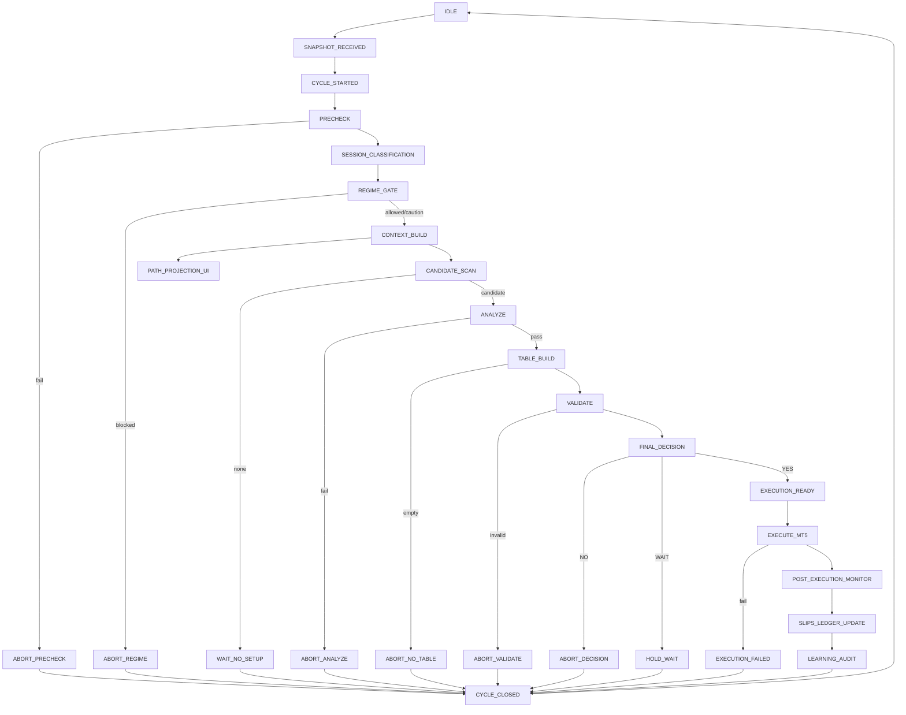

# Trade Auto End-to-End Architecture (Client View)

## Purpose of This Document
This document describes how the Physical Gold EA works from end to end, in business language, aligned with the **Physical Gold Final Pack** (system constitution) and the **Integration Map** (runtime flow).

It confirms that behaviour matches your intended operating model:
- Strict **buy-only physical gold** flow
- **Deterministic core first** — prompts interpret and govern; they do not create orders
- **TABLE** as the **only** execution compiler (no raw AI or Telegram/TradingView may create an order)
- Strong risk protection (waterfall, FAIL, hazard, capital legality)
- Final client control: Auto Trade toggle and approve/reject before execution when in manual path

Scope:
- Core backend + MT5 + AI workflow. UI details are excluded.

---

## Core Principle
The system is:
- **Deterministic EA core first**, prompt layers second
- **TABLE** as the only order builder (BUY_LIMIT / BUY_STOP)
- MT5 as the final order placement layer

No raw AI output, and no Telegram or TradingView message, may create an order. No module may bypass FAIL, waterfall, hazard, or capital legality. Prompts are used to interpret, classify, prioritize, validate, and learn — not to replace the deterministic spine.

---

## The System in One Picture
1. **MT5** sends live market state (ticks, OHLC, spread, session, open/pending orders) to Brain.
2. **Brain** runs the **20-engine flow** in fixed order: session → indicators → structure → volatility → waterfall → hard legality → VERIFY → NEWS → capital utilization → historical pattern → candidate → ANALYZE → **TABLE** → VALIDATE → Final Decision.
3. Only **TABLE** may emit executable orders (BUY_LIMIT / BUY_STOP). VERIFY and NEWS never override FAIL / waterfall / hazard.
4. **Final Decision Engine** outputs YES / NO / WAIT with reason codes.
5. **MT5 Execution** places **pending orders only** (no market buys), after a local final recheck.
6. **MANAGE / RE-ANALYZE** supervises pending/live trades (keep / cancel / replace).
7. **SLIPS** update the ledger and preserve physical bullion truth after fills.
8. **STUDY / SELF-CROSSCHECK / ENGINE HEALTH** support learning and architecture preservation (post-trade / maintenance).

Client control: **Auto Trade** toggle (default OFF) and **approve/reject** for queued trades when not auto-released.

---

## Inputs (Raw Data Only)
- **MT5**: Ticks, OHLC, spread, slippage, open/pending orders, session clock
- **News / calendar**: Event time, tier, actual/forecast/previous, headlines
- **External advisory**: Telegram, TradingView — advisory only, never direct execution
- **Ledger + SLIPS**: Cash AED, gold grams, deployable capital, trade history
- **Historical memory**: Long-term event/session behaviour (used by Historical Pattern Engine)

---

## The 20-Engine Runtime Flow

The live flow runs in this **exact** order. If an earlier engine blocks, later engines do not override it.

### Engines 1–6: Environment and Hard Blockers

| # | Engine | Purpose |
|---|--------|--------|
| **1** | **SESSION ENGINE** | Converts Server/KSA/IST into Japan, India, London, New York, and transition; tags phase (start / mid / end). Session is context only — it never overrides safety. |
| **2** | **INDICATOR ENGINE** | ATR, RSI, MA20, Bands, ADR used, compression/overlap, session highs–lows. Feeds structure and volatility. |
| **3** | **STRUCTURE ENGINE** | Builds S1, S2, R1, R2, FAIL; detects shelf, lid, sweep, reclaim, mid-air zones. Geometric truth layer. |
| **4** | **VOLATILITY / REGIME ENGINE** | Classifies regime (RANGE, RANGE_RELOAD, EXPANSION, EXHAUSTION, LIQUIDATION/SHOCK) and volatility (NORMAL, EXPANDED, EXTREME). EXTREME normally blocks new trades. |
| **5** | **WATERFALL / CRISIS ENGINE** | Distinguishes WATERFALL_CONTINUATION vs FLUSH_REVERSAL_ATTEMPT; triggers crisis veto when needed. Hard blocker: if this says NO, nothing below may force a trade. |
| **6** | **HARD LEGALITY** | Exposure law, slots law, ledger legality, pre-block windows, hazard veto, affordability. If legality fails, the path stops. |

### Engines 7–12: Verification, Context, and Candidate Building

| # | Engine | Purpose |
|---|--------|--------|
| **7** | **VERIFY** | Credibility filter and external-signal parser (Telegram, TradingView). Outputs zone/SL/TP hints and alignment; **never** creates a trade and **never** overrides FAIL / waterfall / hazard. |
| **8** | **NEWS** | Interprets environment and permissions: GlobalRegime, TradingRegime, LiquidityQuality, WaterfallRisk, OverallMODE, Rail permissions, hazard windows, MinutesToNextCleanWindow. |
| **9** | **CAPITAL UTILIZATION** | C1/C2 capacity clamp, sizeState, exposure state, affordableFlag. No ARMED candidate if capital is illegal; TABLE must reject unaffordable trades. |
| **10** | **HISTORICAL PATTERN ENGINE** | Injects long-memory behaviour: historicalPatternTag, ContinuationScore, ExtensionBandUSD, sessionHistoricalModifier. Supports rotation (+8 to +12) vs extension (+20/+30/+50) vs trap/exhaust. |
| **11** | **CANDIDATE ENGINE** | Lifecycle: FORMING → ZONE_WATCH_ACTIVE → EARLY_FLUSH_CANDIDATE → CANDIDATE → ARMED (and PENDING_PLANTED, FILLED, PASSED, OVEREXTENDED, REQUALIFIED, INVALIDATED). **ZONE_WATCH_ACTIVE**: price approaching S1/S2/S3 or aligned zone. **EARLY_FLUSH_CANDIDATE**: flush into defended deep shelf with provisional bottom behaviour. **Mapping rule**: if pathState = OVEREXTENDED and reasonCode = WAITPULLBACKBASE but structure valid → map to ZONE_WATCH_ACTIVE so next flush can promote to EARLY_FLUSH_CANDIDATE. |
| **12** | **ANALYZE** | Converts environment + structure + history into a TABLE-ready trade map: regime, waterfall risk, MID_AIR status, rail status, S1/S2/R1/R2/FAIL, anchors, bottomType, patternType, impulseHarvestScore. **Bottom grammar**: CLASSIC_RECLAIM, FLUSH_ABSORPTION, PANIC_TO_REBUILD, INVALID. **Pattern**: WATERFALL_CONTINUATION, FLUSH_REVERSAL_ATTEMPT. |

### Engines 13–16: Order Build, Validate, Decide, Execute

| # | Engine | Purpose |
|---|--------|--------|
| **13** | **TABLE** | **Only** order builder. Creates BUY_LIMIT and BUY_STOP only. Re-checks FAIL, waterfall, hazard, candidate freshness, structure, rail permissions, capital, slots, volatility, reward law. **Hard profit laws**: projectedMoveNetUSD ≥ 8 USD (net after spread and bullion handicap); STANDARD_ROTATION_MODE: +8 to +12 USD; IMPULSE_HARVEST_MODE: +20/+30/+50 only when explicitly allowed and safety gates pass. **Template FLUSH_LIMIT_CAPTURE**: deep flush into S2/S3, valid bottom, pattern = FLUSH_REVERSAL_ATTEMPT, WaterfallRisk not HIGH, FAIL protected — BUY_LIMIT in upper part of deep zone, default TP +8 to +12. |
| **14** | **VALIDATE** | Reality scrub: expiry realism, size realism, session-phase realism, aggressiveness vs confidence, impulse-mode coherence, net-edge realism. May downgrade, resize, or reject; never invents a trade. |
| **15** | **FINAL DECISION ENGINE** | Outputs YES / NO / WAIT with reason codes. Capital protected / armed / notrade. |
| **16** | **MT5 EXECUTION** | Pending orders only; no market buys; local final recheck before placement. |

### Engines 17–20: Post-Execution and Learning

| # | Engine | Purpose |
|---|--------|--------|
| **17** | **MANAGE / RE-ANALYZE** | Supervises pending/live trades: keep / cancel / replace; re-checks TP realism; reacts to hazard or structure changes; prevents zombie orders. |
| **18** | **SLIPS** | Buy/sell slips; ledger update; physical bullion truth. |
| **19** | **STUDY / SELF-CROSSCHECK** | Blocked-valid setups, missed rotations, overblocking/profit leaks. Improves the machine without drifting from the framework. |
| **20** | **ENGINE HEALTH / REGRESSION** | Rebuild / audit / non-live tuning; prevent architecture drift. |

---

## Core Components and Their Roles

### MT5 Expert Advisor (`mt5ea`)
- Watches live ticks for XAUUSD; builds market snapshots (multi-timeframe, quality, context)
- Sends snapshots to Brain; polls Brain for pending trades
- Executes **BUY_LIMIT** and **BUY_STOP** only; sends execution updates back
- Enforces locally: valid price/TP/lifetime, configurable minimum grams, no execution if high-risk or capital-protected

### Brain (`brain`)
- Central orchestration: receives snapshots and runs the 20-engine flow (or equivalent hierarchy that respects the same order and laws). The canonical 20-engine sequence is implemented in **PhysicalGoldEngineOrchestrator** (Session → Indicator → Structure → Volatility → Waterfall → Hard Legality → VERIFY → NEWS → Capital Utilization → Historical Pattern → Candidate → ANALYZE → TABLE → VALIDATE → Final Decision); engines 16–20 (MT5, MANAGE, SLIPS, STUDY, ENGINE HEALTH) are applied by the calling service and post-trade flows.
- Runs Session, Indicator, Structure, Volatility, Waterfall, Hard Legality, VERIFY, NEWS, Capital Utilization, Historical Pattern, Candidate, ANALYZE, TABLE, VALIDATE, Final Decision
- Routes orders to MT5 queue or approval queue based on Auto Trade toggle and execution mode
- Exposes approve/reject, monitoring, panic interrupt
- Logs full timeline events

### AI Worker (`aiworker`)
- Builds context from market, Telegram, macro
- Pre-flight gate: freshness, risk state, session budget
- Single-lead model for live decisions; validation/study/self-crosscheck reserved for async STUDY flows
- Returns structured signal and safety metadata; returns NO_TRADE when gate or safety fails
- **AI does not create orders** — TABLE is the only compiler

### Prompt Library (`prompts`)
- Operating prompt framework for AI providers/stages; used in the AI pipeline for interpretation and governance, not for order creation

---

## Execution and Client Control

### Order Types
- **BUY_LIMIT** and **BUY_STOP** only. No market buys.
- **Pending-before-level law**: BUY_STOP entry > current Ask; BUY_LIMIT entry < current Bid.

### Auto Trade Toggle
- **OFF (default)**: ARMED trades go to approval queue; client must approve or reject.
- **ON**: ARMED trades can be routed to MT5 per execution mode (AUTO / HYBRID / MANUAL).

### Execution Mode
- **AUTO**: Direct MT5 pending queue when Auto Trade is ON.
- **HYBRID**: Direct MT5 for configured sessions (e.g. Japan + India), approval for others.
- **MANUAL**: Always requires manual approval.

### Post-Decision Gates
Before routing, Brain runs:
- **Capital Utilization Gate**: Affordability vs cash and authoritative/MT5 buy price; may resize or reject.
- **Portfolio Exposure Gate**: Rejects if projected exposure exceeds symbol cap (e.g. 25% of equity in grams).

Only orders passing both may proceed to MT5 or approval queue.

### Panic Interrupt
- Client-triggered from Risk screen: cancels all pending orders, sends cancel to MT5, logs PANIC_INTERRUPT_TRIGGERED. Use when FAIL threatened, liquidation pattern, spread explosion, or macro shock.

---

## Hard Profit Filters (TABLE)
- **projectedMoveNetUSD ≥ 8** for any trade (net after spread and bullion handicap).
- **Standard mode**: +8 to +12 USD.
- **Impulse mode**: +20 / +30 / +50 only when IMPULSE_HARVEST_MODE is allowed and historical extension band and all safety gates agree.
- VERIFY cannot override FAIL / waterfall / hazard.

---

## Bottom and Pattern Logic
- **BottomType**: CLASSIC_RECLAIM, FLUSH_ABSORPTION, PANIC_TO_REBUILD, INVALID.
- **PatternType**: WATERFALL_CONTINUATION, FLUSH_REVERSAL_ATTEMPT.
- **TABLE template**: FLUSH_LIMIT_CAPTURE for deep flush into S2/S3 with valid bottom and FLUSH_REVERSAL_ATTEMPT when WaterfallRisk is not HIGH and FAIL is protected.

---

## Candidate State Mapping (Safe-and-Early)
- If **pathState = OVEREXTENDED** and **reasonCode = WAITPULLBACKBASE** but structure remains valid → map to **ZONE_WATCH_ACTIVE** (not pure NOTRADE) so the next flush can promote to **EARLY_FLUSH_CANDIDATE**.

---

## Session and Time
- **Time**: MT5 Server Time = KSA − 50 minutes; IST = Server Time + 3h20m. Classification uses Server Time or IST consistently; never host/browser/app local time.
- **Sessions**: Japan, India, London, New York (with explicit start/mid/end and transition windows per spec). Phase tags (START / MID / END) feed NEWS, ANALYZE, TABLE, MANAGE.

---

## Decision Outcomes
At cycle end the system reaches one of:

1. **NO_TRADE** — e.g. structure failed, news blocked, legality failed, TABLE invalid, score too low, or decision engine gates blocked.
2. **BLOCKED_VALID_SETUP** — Setup passed scoring but blocked by a hard gate; logged for STUDY.
3. **TRADE_APPROVED** → approval queue (when Auto Trade OFF or manual/hybrid path).
4. **TRADE_APPROVED** → MT5 queue (when Auto Trade ON and mode permits).
5. Post-release: order placed, buy triggered, TP hit, or failed/rejected/cancelled.

---

## What This Means for You
The system is a **layered control stack**:
- Deterministic engines establish legality and context first.
- VERIFY and NEWS interpret and set permissions; they do not override hard blockers.
- TABLE alone may emit executable orders (BUY_LIMIT / BUY_STOP).
- VALIDATE scrubs realism; Final Decision outputs YES/NO/WAIT.
- MT5 executes pending orders only after final release.
- Auto Trade toggle and approve/reject give you final control.

**Operating principle**: The system monitors continuously and, when Auto Trade is ON and all core laws pass, can execute trades automatically, with adaptive safety and no bypass of FAIL, waterfall, hazard, or capital rules.

---

## Optional: Replay / Backtest
A replay path runs historical MT5 data through the same decision hierarchy for testing. Execution is always disabled in replay; timeline events are tagged as replay. Same core laws and engine order apply.

---

## Ideal Runtime State Machine (Implemented)

The runtime has two separate layers:

1. **ENGINE LAYER** — Deterministic engines (Session, Indicators, Structure, Regime, Waterfall, Legality, Verify, News, Capital, History, Candidate, Analyze, Table, Validate, Decision, Execution).
2. **STATE MACHINE LAYER** — The cycle controller: when a cycle starts, which engine runs next, where abort/hold happens. TABLE is the only component allowed to emit executable order instructions.

### Top-level states (logged to timeline)

- **STATE_00_IDLE** → waiting for snapshot
- **STATE_01_SNAPSHOT_RECEIVED** → latest market packet accepted
- **STATE_02_CYCLE_STARTED** → cycle_id assigned, context attached
- **STATE_03_PRECHECK** → sanity checks (stale, spread, session)
- **STATE_04_SESSION_CLASSIFICATION** → session = JAPAN/INDIA/LONDON/NEW_YORK, phase = OPEN/EARLY/MID/LATE/END
- **STATE_05_REGIME_GATE** → REGIME_ALLOWED / REGIME_HIGH_CAUTION / REGIME_BLOCKED
- **STATE_06_CONTEXT_BUILD** → deterministic engines build context
- **STATE_06B_PATH_PROJECTION** → path bias, magnets, zones for **UI only** (not execution)
- **STATE_07_CANDIDATE_SCAN** → and onward (ANALYZE, TABLE_BUILD, VALIDATE, FINAL_DECISION, EXECUTION_READY, EXECUTE_MT5, …)
- **ABORT_PRECHECK / ABORT_REGIME** → with reason codes and veto source
- **STATE_17_CYCLE_CLOSED** → archive, return to idle

### Session / phase model

- **SESSION**: JAPAN | INDIA | LONDON | NEW_YORK
- **PHASE**: OPEN | EARLY | MID | LATE | END | TRANSITION | CLOSED

Rules are precise: e.g. **hard block only when Friday AND session == NEW_YORK AND phase in {LATE, END}**. Friday overlap or expansion alone are **CAUTION** (tighter rails), not full abort.

### Path projection (STATE_06B)

- **pathBias**: UP | DOWN | TWO_WAY | RANGE
- **keyMagnets**, **nextTestZone**, **invalidationShelf**, **sessionTargetCorridor**, **confidenceBand**, **summaryLine**
- Exposed via **GET /api/monitoring/path-projection** for the app chart (“where rates are heading”). Not used by execution.

### State machine diagram

---

## Document Alignment
This architecture is aligned with:
- **Physical Gold Final Pack** (spec folder): master constitution, trading philosophy, capital and ledger law, TABLE compiler logic, safety rules.
- **Integration Map** (arch_diagram): 20-engine runtime order, ZONE_WATCH_ACTIVE, EARLY_FLUSH_CANDIDATE, bottom grammar, FLUSH_LIMIT_CAPTURE, HISTORICAL_PATTERN_ENGINE, IMPULSE_HARVEST_MODE, VERIFY/NEWS roles, projectedMoveNetUSD filters, and execution rule: deterministic engines first, TABLE only execution compiler.
