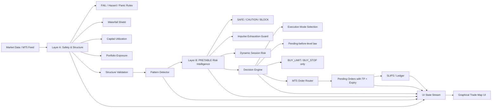

# Brain → PRETABLE → Pattern Detector → Decision Engine → MT5 → UI

## Notes
- Pattern Detector must actively gate PRETABLE, not just log.
- PRETABLE changes **size only** for CAUTION; it cannot override legality.
- MT5 must only receive BUY_LIMIT or BUY_STOP.
- UI is a visualization layer only, not a second decision engine.
